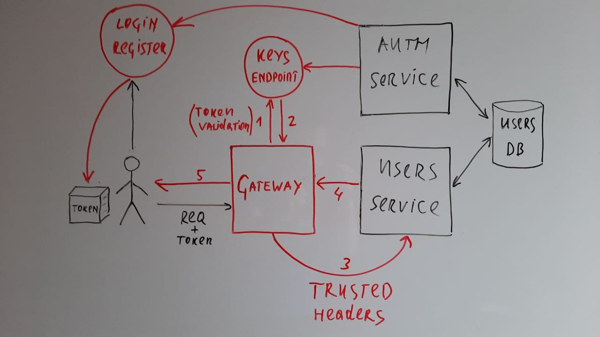

<br />

## Установка:  

Собираем и разворачиваем приложение auth-app:
```shell
helm install auth-app ./auth_app/auth-chart;
```

Собираем и разворачиваем приложение sample-app:
```shell
helm install sample-app ./sample_app/sample-chart;
```

Добавляем репозиторий, устанавливаем ambassador-aes и применяем манифесты
```shell
helm repo add datawire https://getambassador.io;
helm install aes datawire/ambassador -f ./ambassador/values.yaml;
kubectl apply -f ./ambassador/kube_conf;
```

## Тесты:
Cервис пользователей не совсем `Restful` и поддерживает как получение trusted-информации из заголовков в запросах `DELETE /auth/user/`,   
так и rest-схему вроде `DELETE /auth/user/<user_id>/`, то получить доступ к чужой информации можно только получив чужой токен.  
В запросах вроде `DELETE /auth/user/<user_id>/` переданный пользователем `id` сверяется с `X-User-Id`
<br>
####Переменные:
`BASE_URL` - точка входа  
`BAD_USER_ID` - заведомо ложный <user_id>.
<br>

```shell
newman run --env-var "BASE_URL=http://192.168.93.2:32462" --env-var "BAD_USER_ID=0" ./tests/postman_auth_tests.json;
```
