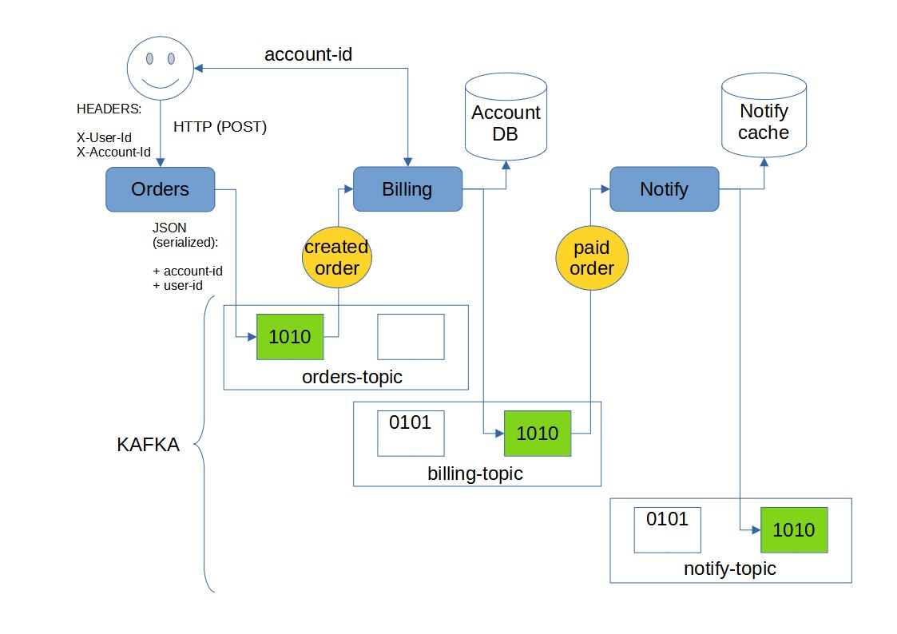

### Обоснование реализации:
* Решение основано на низкоуровневых библиотеках Kafka для выбранного ЯП - `RUST`.  
* Это позволяет наиболее гибко организовать приложение, а также сделать возможным переход на использование обыкновенного `HTTP REST` взаимодействия.  
* Данная схема допускает включение любого узла для доступа со стороны пользователя, например возможно осуществлять `биллинг` по запросу, а не в автоматическом режиме.  
* `Kafka-streams` не используется, так как данная библиотека полноценно реализована только для Java.
Есть аналоги (например `RLink`), но они находятся в начальной стадии разработки, так же как и `KSql`.


# Установка

## Docker Compose:

```shell
env KAFKA_CONTAINER='kafka-container';  # name of the container with Kafka broker
docker exec $KAFKA_CONTAINER /usr/bin/kafka-topics --create --partitions 2 --replication-factor 1 --zookeeper zoo1:2181 --topic order-topic;
docker exec $KAFKA_CONTAINER /usr/bin/kafka-topics --create --partitions 2 --replication-factor 1 --zookeeper zoo1:2181 --topic billing-topic;
docker exec $KAFKA_CONTAINER /usr/bin/kafka-topics --create --partitions 2 --replication-factor 1 --zookeeper zoo1:2181 --topic notify-topic;
```

## Kubernetes:

Добавляем helm репозиторий и устанавливаем чарт:
```shell
helm repo add confluentinc https://confluentinc.github.io/cp-helm-charts/;
helm repo update;
helm install cp-app confluentinc/cp-helm-charts -f ./_charts/confluent/cp-values.yaml;
```

Запускаем Pod с клиентом под Kafka и затем создаем наши топики через этот интерфейс:
```shell
kubectl apply -f ./_charts/confluent/kafka-client.yaml;
kubectl exec kafka-client -- kafka-topics --zookeeper cp-app-cp-zookeeper:2181 --topic order-topic --create --partitions 2 --replication-factor 1;
kubectl exec kafka-client -- kafka-topics --zookeeper cp-app-cp-zookeeper:2181 --topic billing-topic --create --partitions 2 --replication-factor 1;
kubectl exec kafka-client -- kafka-topics --zookeeper cp-app-cp-zookeeper:2181 --topic notify-topic --create --partitions 2 --replication-factor 1;
```

Устанавливаем чарт с нашими сервисами:
```shell
helm install kfk-test-app ./_charts/kafka-app;
```


### Особенности установки в Kubernetes:
Временное решение [проблемы](https://github.com/kubernetes/minikube/issues/11121) с Ingress в Minikube  
(некоторые версии):
```shell
kubectl delete -A ValidatingWebhookConfiguration ingress-nginx-admission;
```


## Тесты:
[Postman](./_tests/99_kafta_test.postman_collection.json)

Порядок запросов:
```
01 -> ACCOUNT_CREATE (billing)   
02 -> ACCOUNT_ADD_MONEY (billing)   
03 -> ORDERS_CREATE (orders)   
04 -> NOTIFY_GET_BY_FILTER (notify)
```
